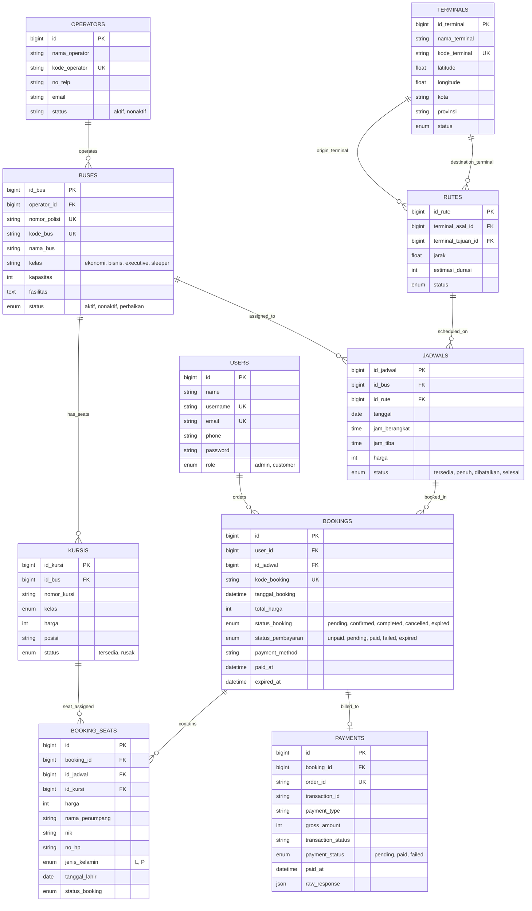
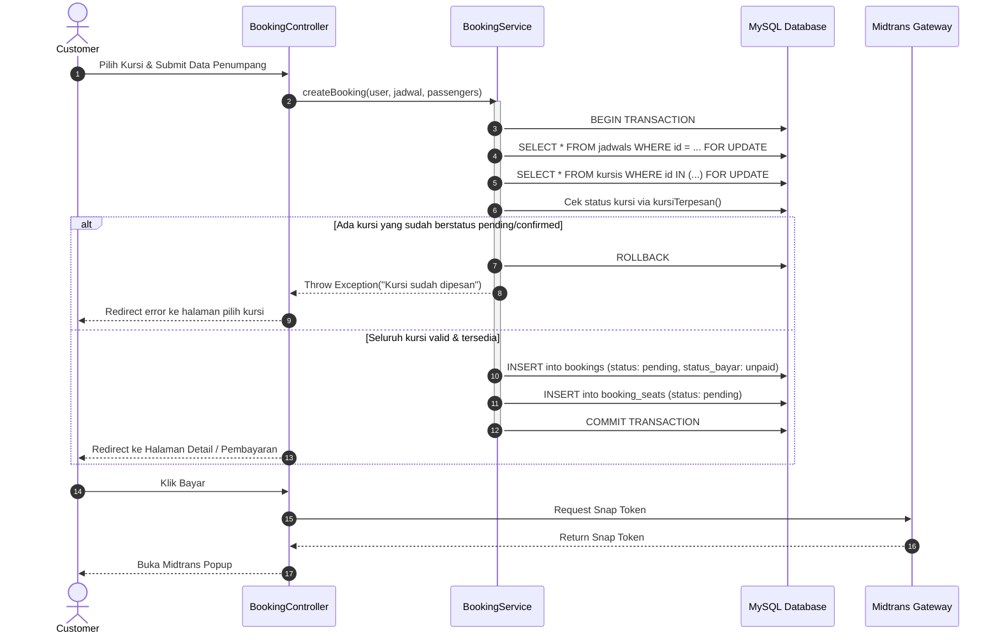

# 📋 PANDUAN PENGEMBANGAN SISTEM PEMESANAN TIKET BUS (DEVELOPMENT GUIDE)
### *Aplikasi Reservasi Tiket Bus AKAP Berbasis Laravel 10 & Playbook Pengembangan dengan Antigravity AI*

Dokumen ini adalah acuan resmi dan komprehensif bagi seluruh developer dan agen AI (**Google Antigravity**) yang mengembangkan, memelihara, dan meningkatkan aplikasi **Pemesanan Tiket Bus**.

---

## 📌 DAFTAR ISI
1. [Ikhtisar Proyek & Domain Bisnis](#1-ikhtisar-proyek--domain-bisnis)
2. [Arsitektur Teknis & Stack Teknologi](#2-arsitektur-teknis--stack-teknologi)
3. [Skema Database & Relasi Model (ERD)](#3-skema-database--relasi-model-erd)
4. [Alur Bisnis Utama (Core Workflows)](#4-alur-bisnis-utama-core-workflows)
5. [Struktur Direktori & Komponen Inti](#5-struktur-direktori--komponen-inti)
6. [Standar & Konvensi Koding](#6-standar--konvensi-koding)
7. [Playbook Pengembangan dengan Google Antigravity](#7-playbook-pengembangan-dengan-google-antigravity)
8. [Temuan Kritis, Schema Drift, & Gotchas](#8-temuan-kritis-schema-drift--gotchas)
9. [Roadmap Pengembangan Kedepan (Future Roadmap & Backlog)](#9-roadmap-pengembangan-kedepan-future-roadmap--backlog)
10. [Runbook Instalasi, Seeder, & Pengujian](#10-runbook-instalasi-seeder--pengujian)

---

## 1. Ikhtisar Proyek & Domain Bisnis

Aplikasi ini merupakan platform pemesanan tiket bus (Antar Kota Antar Provinsi / Pariwisata) yang menghubungkan pengguna umum (penumpang) dengan operator bus. Sistem menyediakan pencarian jadwal perjalanan real-time, denah pemilihan kursi interaktif, checkout pemesanan multi-penumpang, integrasi payment gateway Midtrans Snap, serta penerbitan tiket digital dilengkapi QR Code verifikasi.

### Peran Pengguna (User Roles)
1. **Public / Tamu (Guest)**:
   - Mencari rute dan jadwal bus yang tersedia berdasarkan terminal asal, tujuan, dan tanggal keberangkatan.
   - Melihat rincian armada, harga, fasilitas bus, serta ketersediaan kursi.
   - Melakukan registrasi atau login sebelum menyelesaikan reservasi.
2. **Customer (Penumpang Terdaftar)**:
   - Memilih nomor kursi spesifik pada visualisasi denah bus.
   - Mengisi identitas detail per penumpang (Nama, NIK 16 digit, No. HP, Jenis Kelamin, Tgl Lahir).
   - Melakukan checkout dan membayar secara online via Midtrans Snap (QRIS, VA, E-Wallet, Kartu).
   - Melihat dashboard riwayat pemesanan, status tiket, dan membuka/mencetak E-Tiket ber-QR Code.
   - Memperbarui profil akun pelanggan.
3. **Administrator (Admin Operasional & Keuangan)**:
   - Mengelola Master Data: Operator PO Bus, Armada Bus, Denah/Kursi, Terminal, Rute (dengan hitung jarak & estimasi otomatis), dan Jadwal Keberangkatan.
   - Mengelola Transaksi: Monitoring seluruh pesanan booking, konfirmasi manual pembayaran loket/cash, dan pembatalan pesanan.
   - Monitoring Transaksi Pembayaran dan log audit gateway.
   - Manajemen Akun Pengguna & Admin.
   - Mengakses Laporan Penjualan dan ringkasan operasional.

---

## 2. Arsitektur Teknis & Stack Teknologi

| Komponen | Teknologi | Keterangan |
|---|---|---|
| **Framework Backend** | Laravel 10.x | PHP 8.1+ |
| **Database** | MySQL 8.0+ / MariaDB 10.4+ | Melalui Laragon / XAMPP / Native MySQL |
| **Admin Template** | Stisla Admin Template | Bootstrap 4/5, jQuery, FontAwesome, Ionicons |
| **Asset Pipeline** | Laravel Mix (`webpack.mix.js`) | Menyalin dependency dari `node_modules` ke `public/library/`. **Bukan Vite**. |
| **Payment Gateway** | Midtrans Snap PHP SDK | Snap popup checkout & Webhook IPN notification |
| **QR Code Engine** | `simplesoftwareio/simple-qrcode` | SVG QR Code generator untuk tiket digital |
| **Authentication** | Custom Session-based Auth | Diatur oleh `AuthController` & middleware `ValidasiUser` + `CheckRole` |
| **Code Formatter** | Laravel Pint (`vendor/bin/pint`) | PSR-12 standard formatting |

---

## 3. Skema Database & Relasi Model (ERD)

Aplikasi memiliki skema terstruktur dengan relasi entitas berikut:



### Konvensi Primary Key & Foreign Key
Perhatikan bahwa model lama dan baru menggunakan pola PK yang perlu diperhatikan saat membuat relasi Eloquent:
- Model `Bus`: PK `id_bus`
- Model `Terminal`: PK `id_terminal`
- Model `Rute`: PK `id_rute`
- Model `Kursi`: PK `id_kursi`
- Model `Jadwal`: PK `id_jadwal`
- Model `User`, `Operator`, `Booking`, `BookingSeat`, `Payment`: PK `id`

*Pastikan selalu menuliskan argumen foreign key dan local key secara eksplisit pada definisi relasi model!*

---

## 4. Alur Bisnis Utama (Core Workflows)

### 4.1. Alur Pemesanan & Pencegahan Race Condition (Concurrency Locking)
Untuk mencegah **double-booking** (dua customer memesan kursi yang sama pada detik yang bersamaan), proses reservasi diisolasi di dalam `app/Services/BookingService.php` dengan mekanisme transaksi database dan pesimistic row locking:



### 4.2. Siklus Pembayaran & Webhook Callback (IPN)
1. Customer menyelesaikan pembayaran di Midtrans Snap (misal via QRIS/BCA VA).
2. Midtrans mengirimkan HTTP POST asynchronous notification ke `/payment/callback` (`BookingController@callback` -> `PaymentService@handleNotification`).
3. Endpoint ini dikecualikan dari proteksi CSRF di `VerifyCsrfToken.php`.
4. `PaymentService` memvalidasi kesesuaian `gross_amount` dengan database untuk mencegah tampering.
5. Jika status `settlement` atau `capture` (fraud `accept`), status pesanan diperbarui menjadi:
   - `bookings.status_pembayaran = 'paid'`
   - `bookings.status_booking = 'confirmed'`
   - `booking_seats.status_booking = 'confirmed'`
6. Tiket digital otomatis aktif dan QR code dapat diakses oleh customer.

---

## 5. Struktur Direktori & Komponen Inti

```
app/
├── Http/
│   ├── Controllers/
│   │   ├── AdminBookingController.php    # Manajemen booking oleh admin
│   │   ├── AdminCustomerController.php   # Manajemen data customer
│   │   ├── AuthController.php            # Custom auth (login, register, logout)
│   │   ├── BookingController.php         # Customer booking & payment view
│   │   ├── BusController.php             # CRUD Armada bus (admin)
│   │   ├── CustomerController.php        # Dashboard & riwayat tiket customer
│   │   ├── DashboardController.php       # Dashboard statistik admin
│   │   ├── HomeController.php            # Landing page publik
│   │   ├── JadwalController.php          # CRUD Jadwal keberangkatan bus
│   │   ├── KursiController.php           # CRUD & generator denah kursi
│   │   ├── OperatorController.php        # CRUD PO Bus/Operator
│   │   ├── PaymentController.php         # Audit transaksi pembayaran
│   │   ├── RuteController.php            # CRUD Rute + Ajax hitung jarak otomatis
│   │   ├── TerminalController.php        # CRUD Terminal asal & tujuan
│   │   └── TicketController.php          # Pencarian jadwal & pemilihan kursi publik
│   └── Middleware/
│       ├── ValidasiUser.php              # Memeriksa session 'cek'
│       └── CheckRole.php                 # Memeriksa kecocokan session 'role'
├── Models/
│   ├── Booking.php                       # Model transaksi pesanan utama
│   ├── BookingSeat.php                   # Detail kursi & data penumpang per pesanan
│   ├── bus.php                           # Model bus armada (Catatan: perhatikan case-sensitivity)
│   ├── Jadwal.php                        # Model jadwal & ketersediaan kursi
│   ├── kursi.php                         # Model master kursi per bus
│   ├── Operator.php                      # Model PO Bus
│   ├── Payment.php                       # Model rekaman transaksi pembayaran gateway
│   ├── rute.php                          # Model rute antar terminal
│   ├── terminal.php                      # Model terminal asal & tujuan
│   └── User.php                          # Model pengguna (admin & customer)
├── Services/
│   ├── BookingService.php                # Logic transaksi booking, locking, nomor booking
│   ├── PaymentService.php                # Integrasi Midtrans SDK & Webhook handler
│   └── TicketService.php                 # Logic ekstraksi data e-tiket & QR generator
database/
├── factories/                            # Generator fake data untuk unit/feature testing
├── migrations/                           # Skema DDL seluruh tabel database
└── seeders/                              # DatabaseSeeder, UserSeeder, BusSeeder, dll.
resources/views/
├── layouts/
│   ├── app.blade.php                     # Layout Stisla dashboard admin
│   ├── landing/                          # Layout halaman publik / landing
│   └── user/                             # Layout dashboard customer
└── pages/
    ├── admin/                            # Blade view seluruh modul master & transaksi admin
    ├── auth/                             # Blade view login & register
    ├── booking/                          # View formulir penumpang, pembayaran, & e-tiket
    ├── customer/                         # View profil & riwayat booking customer
    └── tiket/                            # View pencarian jadwal & denah kursi interaktif
```

---

## 6. Standar & Konvensi Koding

1. **Routing**:
   - Gunakan format modern callable array: `Route::get('/path', [Controller::class, 'method'])->name('name');`.
   - Admin route dikelompokkan dalam prefix `/admin` dengan middleware `['ValidasiUser', 'CheckRole:admin']`.
   - Customer route dikelompokkan dalam middleware `['ValidasiUser', 'CheckRole:customer']`.
2. **Service Layer**:
   - Jangan menuliskan business logic berat (seperti kalkulasi total bayar, locking row database, atau panggilan API Midtrans) langsung di Controller.
   - Pindahkan logic ke dalam `app/Services/`. Controller hanya bertugas menangani HTTP Request, validasi input, memanggil service, dan mengembalikan Response (View/JSON).
3. **Database Transactions**:
   - Seluruh mutasi data yang melibatkan lebih dari satu tabel (contoh: pembuatan `bookings` + `booking_seats`, atau update status booking + payment) **WAJIB** dibungkus di dalam `DB::transaction(function() { ... })`.
4. **Formatting & Linter**:
   - Format kode PHP menggunakan Laravel Pint:
     ```bash
     vendor/bin/pint
     ```
5. **View & CSS**:
   - Gunakan komponen Bootstrap dari Stisla.
   - Aset statis diletakkan di `public/library/` dan dipanggil via helper `asset('library/...')`.

---

## 7. Playbook Pengembangan dengan Google Antigravity

Saat Anda (atau tim) mengembangkan proyek ini bersama Antigravity CLI / IDE, manfaatkan fitur-fitur agen AI berikut:

### 7.1. Rekomendasi Slash Commands untuk Task Proyek

| Slash Command | Kapan Harus Direkomendasikan / Digunakan | Contoh Kasus dalam Proyek |
|---|---|---|
| **`/plan`** | Ketika merancang fitur baru yang memiliki banyak dependensi atau modul arsitektur. | "Rancang sistem pembatalan dan refund tiket otomatis via Midtrans." |
| **`/grill-me`** | Ketika ingin membedah trade-off desain atau requirement bisnis sebelum menulis kode. | "Wawancarai saya untuk menentukan aturan rescheduling tiket (H-24 jam, denda 20%)." |
| **`/boost`** | Ketika menangani logic kritis yang membutuhkan deep reasoning, audit keamanan, atau audit performa tinggi. | "Audit fungsi `BookingService::createBooking` untuk memastikan tidak ada celah deadlock atau race condition." |
| **`/goal`** | Untuk task panjang yang harus tuntas tanpa jeda (long-running autonomous execution). | "Jalankan refactoring seluruh nama file Model dari lowercase menjadi PascalCase dan pastikan seluruh test lulus." |
| **`/schedule`** | Untuk menjadwalkan command background atau reminder otomatis. | "Jadwalkan pengecekan status background task atau artisan queue worker." |
| **`/learn`** | Ketika agen berhasil memecahkan bug setup lokal yang rumit dan ingin diingat pada sesi berikutnya. | "Simpan pola konfigurasi webhook Midtrans sandbox untuk environment lokal Laragon." |

### 7.2. Pemanfaatan Subagents
- **Subagent `research`**: Gunakan saat perlu membaca referensi dokumentasi luar (misal: API Midtrans docs, spesifikasi QR Code, atau format NIK Indonesia) tanpa mengotori context window utama.
- **Subagent `self`**: Gunakan saat ingin menjalankan task pengujian atau pembuatan skrip scratch di lingkungan terisolasi.

### 7.3. Konfigurasi Rules & Context Files
Antigravity membaca aturan proyek secara hierarkis:
- **`AGENTS.md`**: Aturan level workspace yang dibaca otomatis oleh Antigravity pada setiap sesi.
- Pastikan informasi pada `AGENTS.md` selalu disinkronkan jika ada perubahan arsitektur mayor.

---

## 8. Temuan Kritis, Schema Drift, & Gotchas

> [!CAUTION]
> **PENTING UNTUK DIPERHATIKAN SEBELUM MELAKUKAN MIGRATION / TESTING:**

1. **Schema Drift Kolom `kelas` pada Tabel `buses`**:
   - Pada file migrasi `database/migrations/2026_07_18_232021_create_buses_table.php`, baris definisi kolom `kelas` ditemukan dalam kondisi terkomentari:
     ```php
     // $table->enum('kelas', ['ekonomi', 'bisnis', 'executive', 'sleeper'])->default('ekonomi');
     ```
   - Namun, `BusController.php`, `Bus.php` model `$fillable`, dan `BusFactory.php` mewajibkan kolom `kelas`.
   - Akibatnya: Test database atau proses create bus baru akan error `1054 Unknown column 'kelas'`.
   - **Solusi Rekomendasi**: Buka komentar pada migration atau buat migration baru:
     ```bash
     php artisan make:migration add_kelas_to_buses_table --table=buses
     ```
2. **Case Sensitivity Nama File Model (Linux vs Windows)**:
   - Beberapa file model menggunakan huruf kecil pada nama file fisik, misalnya:
     - `app/Models/bus.php` -> `class Bus`
     - `app/Models/kursi.php` -> `class Kursi`
     - `app/Models/rute.php` -> `class Rute`
     - `app/Models/terminal.php` -> `class Terminal`
   - Di Windows (Laragon), filesystem bersifat *case-insensitive* sehingga tidak ada masalah.
   - Namun di server Linux (Ubuntu, Docker, CI/CD), autoloader PSR-4 akan gagal menemukan class tersebut (fatal error `Class 'App\Models\Bus' not found`).
   - **Solusi**: Rename file-file tersebut menjadi PascalCase (`Bus.php`, `Kursi.php`, `Rute.php`, `Terminal.php`) saat persiapan deployment.
3. **Asset Pipeline (Laravel Mix vs Vite)**:
   - Proyek memiliki file `vite.config.js`, namun layout Blade sama sekali tidak menggunakan directive `@vite`.
   - Jangan jalankan `npm run dev` atau `npm run build`.
   - Asset pipeline yang sah adalah **Laravel Mix**:
     ```bash
     npx mix
     ```
     Perintah ini menyalin library vendor ke `public/library/`.
4. **Custom Session Authentication**:
   - Sistem tidak memakai guard standar `auth()->user()`, melainkan membaca session manual:
     - `Session('cek') === true`
     - `Session('user_id')`
     - `Session('role')` (`admin` atau `customer`)
   - Saat menulis controller baru, selalu hormati middleware `ValidasiUser` dan `CheckRole`.
5. **Midtrans Sandbox Config**:
   - Pastikan variabel berikut ada di `.env`:
     ```env
     MIDTRANS_CLIENT_KEY=SB-Mid-client-xxxxxxxx
     MIDTRANS_SERVER_KEY=SB-Mid-server-xxxxxxxx
     MIDTRANS_IS_PRODUCTION=false
     ```

---

## 9. Roadmap Pengembangan Kedepan (Future Roadmap & Backlog)

Berikut rencana tahapan pengembangan terstruktur yang siap dieksekusi:

### 🟢 Fase 1: Perbaikan Stabilitas & Hardening (Immediate)
- [ ] **Fix Schema Bus**: Tambahkan kolom `kelas` pada migrasi `buses` dan pastikan seluruh test suite `php artisan test` berstatus hijau (100% pass).
- [ ] **Rename Model Files**: Ubah nama file model menjadi PascalCase (`Bus.php`, `Kursi.php`, `Rute.php`, `Terminal.php`).
- [ ] **Auto-Cancel Expired Bookings**: Buat Laravel Artisan Command & Scheduled Job (`php artisan booking:cancel-expired`) yang otomatis membatalkan pesanan pending yang telah melewati `expired_at` dan melepaskan kuncian kursi.

### 🟡 Fase 2: Fitur Customer & Operasional Tiket (Short-Term)
- [ ] **Export Tiket PDF Resmi**: Integrasi `barryvdh/laravel-dompdf` untuk mengunduh e-tiket berformat PDF siap cetak dengan barcode Code128 dan QR Code.
- [ ] **Notifikasi WhatsApp Otomatis**: Integrasi API gateway WhatsApp (seperti Fonnte / Wablas) untuk mengirim link e-tiket dan pengingat jadwal H-4 jam keberangkatan langsung ke nomor HP penumpang.
- [ ] **Fitur Reschedule & Pembatalan**: Portal mandiri bagi customer untuk mengajukan perubahan jadwal tiket dengan kebijakan potongan biaya administrasi.
- [ ] **Filter Pencarian Lanjutan**: Filter pencarian tiket publik berdasarkan operator tertentu, rentang harga, kelas bus, dan jam keberangkatan (pagi/siang/malam).

### 🟠 Fase 3: Operasional Lapangan & Manajemen Loket (Mid-Term)
- [ ] **Portal Scanner Tiket Petugas (Boarding Gate)**: Halaman khusus petugas terminal dengan kamera web / scanner barcode untuk memvalidasi keaslian tiket saat penumpang check-in ke bus.
- [ ] **Manifest Penumpang Bus**: Cetak daftar manifest penumpang (nama, kursi, NIK, kontak darurat) untuk diserahkan kepada supir dan kondektur sebelum bus diberangkatkan.
- [ ] **Multi-Operator Dashboard (Multi-tenancy)**: Hak akses khusus untuk operator PO Bus agar masing-masing PO hanya dapat melihat dan mengatur armada serta jadwal milik perusahaannya sendiri.

### 🔵 Fase 4: Analitik Bisnis & Kesiapan API Mobile (Long-Term)
- [ ] **Laporan Penjualan & Ekspor Excel**: Modul rekapitulasi omset, okupansi kursi per rute, dan komisi loket dengan ekspor file Excel (`maatwebsite/excel`).
- [ ] **REST API Mobile Ready**: Penerapan Laravel Sanctum API endpoints (Authentication, Search, Seat Layout, Booking, Payment Webhook) untuk mendukung aplikasi mobile (Flutter / Android / iOS).

---

## 10. Runbook Instalasi, Seeder, & Pengujian

### 10.1. Langkah Instalasi Awal
```bash
# 1. Clone repository & masuk ke direktori
cd C:\laragon\www\rap

# 2. Install dependensi PHP
composer install

# 3. Salin file environment & generate app key
cp .env.example .env
php artisan key:generate

# 4. Konfigurasi database di file .env
# DB_DATABASE=malam_rabu (atau nama database lokal Anda)
# DB_USERNAME=root
# DB_PASSWORD=

# 5. Install dependensi Javascript & build aset library
npm install
npx mix

# 6. Jalankan migrasi dan seeder data awal
php artisan migrate:fresh --seed

# 7. Jalankan server lokal
php artisan serve
```

### 10.2. Akun Kredensial Default (Hasil Seeder)
| Role | Username / Email | Password | Keterangan |
|---|---|---|---|
| **Super Admin** | `admin` / `admin@busticket.test` | `password` | Akses penuh dashboard admin |
| **Admin Operasional** | `admin2` / `admin2@busticket.test` | `password` | Staf operasional |
| **Admin Keuangan** | `admin3` / `admin3@busticket.test` | `password` | Staf verifikasi pembayaran |
| **Customer Demo** | `customer` / `customer@busticket.test` | `password` | Penumpang demo untuk testing reservasi |

### 10.3. Menjalankan Pengujian Otomatis
```bash
# Menjalankan seluruh test suite
php artisan test

# Menjalankan spesifik test booking flow
php artisan test --filter BookingFlowTest
```

### 10.4. Simulasi Pembayaran Midtrans Lokal
Untuk menguji webhook Midtrans di localhost Laragon:
1. Jalankan tunneling tools seperti ngrok: `ngrok http 8000`
2. Buka Dashboard Midtrans Simulator: `https://dashboard.sandbox.midtrans.com/`
3. Atur Payment Notification URL ke: `https://<subdomain-ngrok>.ngrok-free.app/payment/callback`
4. Lakukan pembayaran menggunakan kartu kredit test atau Simulator Virtual Account Midtrans.
