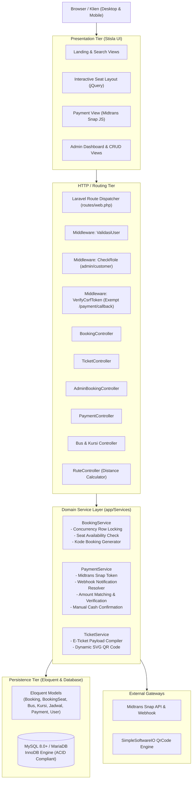
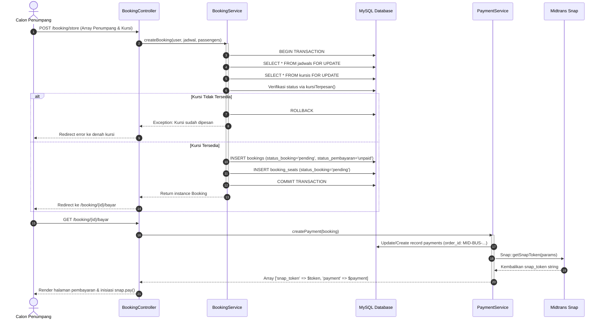
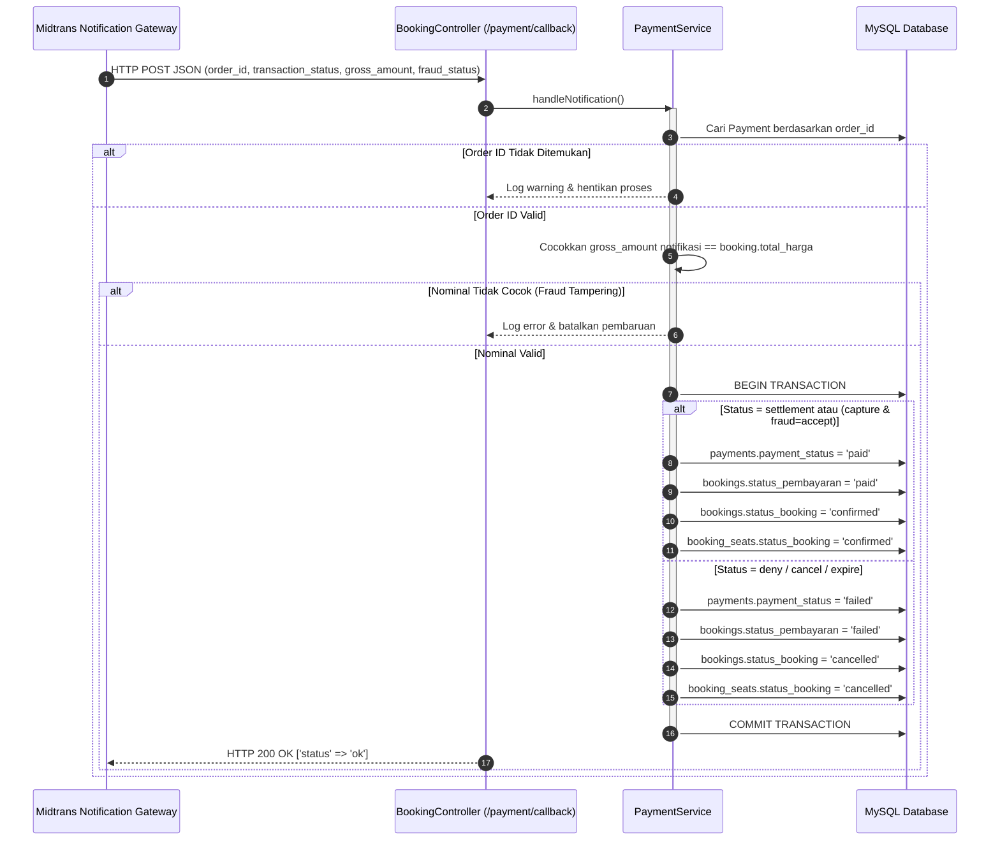

# 🏛️ SYSTEM ARCHITECTURE DOCUMENT (SAD)
## Arsitektur Sistem Informasi Pemesanan Tiket Bus

---

## 1. Ikhtisar Arsitektur (Architectural Overview)

Aplikasi **Pemesanan Tiket Bus** dibangun menggunakan pola **Layered Architecture (Arsitektur Berlapis)** berbasis framework **Laravel 10 (PHP 8.1+)** dengan penguatan **Service Layer Pattern**. Pemisahan tanggung jawab (*Separation of Concerns*) dilakukan secara ketat antara penanganan protokol HTTP (Controller), pemrosesan logika bisnis inti (Services), dan persistensi data (Eloquent ORM & MySQL InnoDB).

```
┌─────────────────────────────────────────────────────────────┐
│                 PRESENTATION LAYER (UI)                     │
│    Blade Views • Stisla CSS/JS • jQuery • AJAX Requests     │
└──────────────────────────────┬──────────────────────────────┘
                               │ HTTP Request
┌──────────────────────────────▼──────────────────────────────┐
│                  APPLICATION / HTTP LAYER                   │
│   Routing (web.php) • Middleware Pipeline • Controllers     │
└──────────────────────────────┬──────────────────────────────┘
                               │ Delegasi Tugas
┌──────────────────────────────▼──────────────────────────────┐
│                    BUSINESS SERVICE LAYER                   │
│     BookingService   •   PaymentService   •  TicketService  │
└──────────────────────────────┬──────────────────────────────┘
                               │ Query & Transaksi
┌──────────────────────────────▼──────────────────────────────┐
│                      PERSISTENCE LAYER                      │
│        Eloquent ORM Models (Active Record Pattern)          │
│          MySQL 8.0+ Database (InnoDB Engine, Row Locks)     │
└──────────────────────────────┬──────────────────────────────┘
                               │ Panggilan API / SDK
┌──────────────────────────────▼──────────────────────────────┐
│                 EXTERNAL INTEGRATION LAYER                  │
│       Midtrans Snap SDK (Payment) • Simple QrCode (SVG)     │
└─────────────────────────────────────────────────────────────┘
```

---

## 2. Diagram Komponen Sistem (Component Architecture)

Diagram berikut mengilustrasikan interaksi antar komponen dalam arsitektur aplikasi:



---

## 3. Desain Concurrency & Integritas Transaksi (Pessimistic Locking)

Salah satu tantangan terberat dalam sistem reservasi tiket adalah mencegah **Double Booking** pada saat trafik tinggi. Sistem ini menggunakan **Pessimistic Row-Level Locking (`lockForUpdate()`)** yang diproteksi di dalam blok `DB::transaction()`.

### Mekanisme Penguncian:
1. Ketika pemesanan dimulai di [`BookingService::createBooking()`](file:///C:/laragon/www/rap/app/Services/BookingService.php#L55):
   ```php
   return DB::transaction(function () use ($user, $jadwal, $passengers) {
       // Kunci jadwal untuk mencegah modifikasi jadwal selama pemesanan
       $locked = Jadwal::whereKey($jadwal->id_jadwal)->lockForUpdate()->first();

       // Kunci kursi yang dipilih
       $kursis = Kursi::whereIn('id_kursi', $seatIds)
           ->where('id_bus', $jadwal->id_bus)
           ->lockForUpdate()
           ->get();

       // Validasi ketersediaan: apakah kursi sudah terdaftar di booking_seats aktif?
       foreach ($kursis as $kursi) {
           if (!$this->isSeatAvailable($locked, $kursi)) {
               throw new \Exception("Kursi {$kursi->nomor_kursi} sudah dipesan orang lain.");
           }
       }

       // Simpan record booking dan booking_seats...
   });
   ```
2. **Keuntungan Pendekatan Ini**:
   - Menghindari *race condition* di level memori dan jaringan.
   - Database MySQL menahan thread permintaan kedua hingga transaksi pertama selesai (`COMMIT` atau `ROLLBACK`).
   - Jika transaksi pertama berhasil mengklaim kursi, permintaan kedua otomatis mendeteksi status terpesan dan melempar Exception secara aman tanpa merusak data.

---

## 4. Alur Transaksi & Diagram Sekuensial (Sequence Diagrams)

### 4.1. Alur Pemesanan & Pembayaran Midtrans Snap


### 4.2. Alur Webhook Asynchronous IPN (Instant Payment Notification)


---

## 5. Model Keamanan & Autentikasi

### 5.1. Session-Based Custom Authentication
Sistem menggunakan autentikasi sesi mandiri yang diatur oleh [`AuthController`](file:///C:/laragon/www/rap/app/Http/Controllers/AuthController.php):
- Data sesi pengguna disimpan di `Session`:
  - `user_id`: ID unik pengguna di tabel `users`.
  - `role`: string peran pengguna (`admin` atau `customer`).
  - `cek`: boolean flag status login (`true`).
- **Middleware Guarding**:
  - [`ValidasiUser`](file:///C:/laragon/www/rap/app/Http/Middleware/ValidasiUser.php): Memastikan `Session('cek') === true`.
  - [`CheckRole`](file:///C:/laragon/www/rap/app/Http/Middleware/CheckRole.php): Memastikan `Session('role') === $role` (contoh: `CheckRole:admin` untuk area `/admin` dan `CheckRole:customer` untuk area `/customer`).

### 5.2. Otorisasi Kepemilikan Data (Ownership Authorization)
Pada seluruh aksi melihat detail pesanan, pembayaran, dan cetak tiket, diterapkan metode proteksi kepemilikan data:
```php
private function authorizeOwnership(Booking $booking): void
{
    if (Session('role') === 'admin') {
        return; // Admin memiliki wewenang melihat seluruh pesanan
    }

    if ($booking->user_id != Session('user_id')) {
        abort(403, 'Anda tidak berhak mengakses booking ini.');
    }
}
```
Aturan ini mencegah eksploitasi IDOR (*Insecure Direct Object Reference*).

### 5.3. Proteksi Webhook Gateway
- Endpoint `/payment/callback` dikecualikan dari pengecekan CSRF pada `app/Http/Middleware/VerifyCsrfToken.php`.
- Proteksi keamanan dilakukan dengan memvalidasi keberadaan `order_id` yang terdaftar serta mencocokkan nilai `gross_amount` numerik sebelum memproses status.

---

## 6. Desain Performa & Skalabilitas

1. **Eager Loading Relasi**:
   Untuk mencegah problem *N+1 Queries*, pemanggilan data selalu menyertakan relasi secara eksplisit menggunakan `with()`:
   ```php
   Jadwal::with(['bus.kursis', 'rute.terminalAsal', 'rute.terminalTujuan', 'bus.operator'])
   ```
2. **Kalkulasi Jarak Geografis**:
   [`RuteController`](file:///C:/laragon/www/rap/app/Http/Controllers/RuteController.php) menyediakan endpoint AJAX untuk menghitung estimasi jarak (KM) dan durasi perjalanan (menit) berdasarkan koordinat latitude & longitude dari terminal asal dan tujuan.
3. **Penyimpanan Gambar & QR Code**:
   Tiket QR Code di-generate secara *on-the-fly* dalam format **SVG Data URI** (`data:image/svg+xml;base64,...`) oleh [`TicketService`](file:///C:/laragon/www/rap/app/Services/TicketService.php) tanpa membebani disk penyimpanan lokal dengan ribuan file gambar statis.
