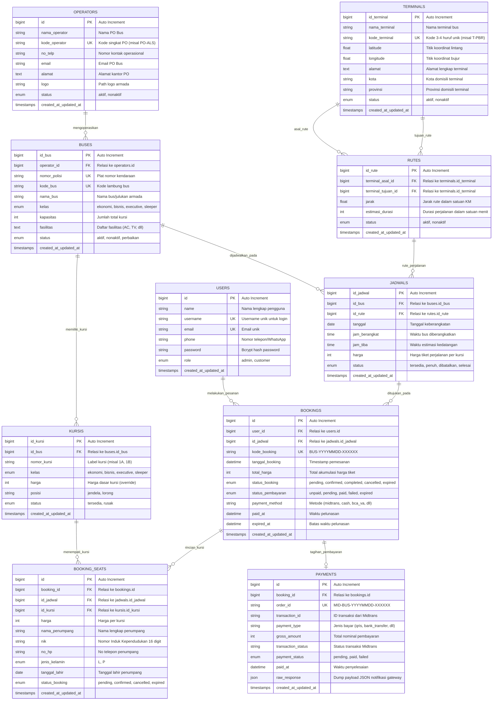
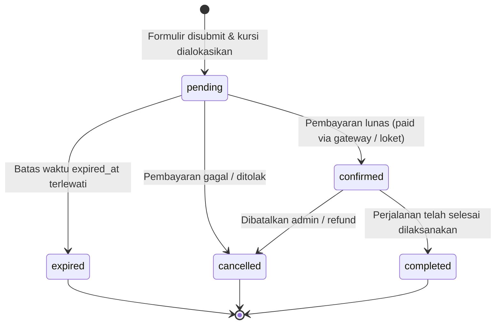

# 🗄️ DATABASE SPECIFICATION & DATA DICTIONARY
## Spesifikasi Basis Data & Kamus Data Sistem Pemesanan Tiket Bus

---

## 1. Ikhtisar Basis Data

- **DBMS**: MySQL 8.0+ / MariaDB 10.4+
- **Storage Engine**: `InnoDB` (Mendukung transaksi ACID, Foreign Key constraints, dan Row-Level Locking)
- **Karakter Set & Collation**: `utf8mb4` / `utf8mb4_unicode_ci`
- **Total Entitas Utama**: 10 Tabel

---

## 2. Entity Relationship Diagram (ERD)

---

## 3. Kamus Data Lengkap (Data Dictionary)

### 3.1. Tabel `users`
Menyimpan kredensial pengguna, profil, dan hak akses otorisasi.
| Kolom | Tipe Data | Nullable | Default | Keterangan |
|---|---|---|---|---|
| `id` | BIGINT UNSIGNED | Tidak | Auto Inc | Primary Key |
| `name` | VARCHAR(255) | Tidak | - | Nama lengkap pengguna |
| `username` | VARCHAR(255) | Tidak | - | Username unik |
| `email` | VARCHAR(255) | Tidak | - | Email unik |
| `phone` | VARCHAR(30) | Ya | NULL | Nomor kontak/WhatsApp |
| `password` | VARCHAR(255) | Tidak | - | Bcrypt hash password |
| `role` | ENUM('admin','customer') | Tidak | 'customer' | Hak akses sistem |
| `remember_token` | VARCHAR(100) | Ya | NULL | Token persistensi login |
| `created_at` / `updated_at` | TIMESTAMP | Ya | NULL | Log waktu |

### 3.2. Tabel `operators`
Menyimpan data identitas Perusahaan Otobus (PO Bus).
| Kolom | Tipe Data | Nullable | Default | Keterangan |
|---|---|---|---|---|
| `id` | BIGINT UNSIGNED | Tidak | Auto Inc | Primary Key |
| `nama_operator` | VARCHAR(100) | Tidak | - | Nama PO Bus |
| `kode_operator` | VARCHAR(20) | Tidak | - | Kode unik PO |
| `no_telp` | VARCHAR(20) | Ya | NULL | No kontak telepon |
| `email` | VARCHAR(100) | Ya | NULL | Alamat email resmi PO |
| `alamat` | TEXT | Ya | NULL | Kantor pusat PO |
| `logo` | VARCHAR(255) | Ya | NULL | Path logo |
| `status` | ENUM('aktif','nonaktif') | Tidak | 'aktif' | Status operasional PO |
| `created_at` / `updated_at` | TIMESTAMP | Ya | NULL | Log waktu |

### 3.3. Tabel `buses`
Menyimpan spesifikasi fisik dan kepemilikan armada bus.
| Kolom | Tipe Data | Nullable | Default | Keterangan |
|---|---|---|---|---|
| `id_bus` | BIGINT UNSIGNED | Tidak | Auto Inc | Primary Key |
| `operator_id` | BIGINT UNSIGNED | Tidak | - | Foreign Key ke `operators.id` (Cascade On Delete) |
| `nomor_polisi` | VARCHAR(20) | Tidak | - | Plat nomor unik kendaraan |
| `kode_bus` | VARCHAR(30) | Tidak | - | Kode lambung bus unik |
| `nama_bus` | VARCHAR(100) | Tidak | - | Nama/julukan bus |
| `kelas` | ENUM('ekonomi','bisnis','executive','sleeper') | Tidak | 'ekonomi' | **Catatan**: Wajib aktif pada migrasi |
| `kapasitas` | INT | Tidak | - | Jumlah kapasitas kursi |
| `fasilitas` | TEXT | Ya | NULL | Rincian fasilitas bus |
| `status` | ENUM('aktif','nonaktif','perbaikan') | Tidak | 'aktif' | Status kesiapan armada |
| `created_at` / `updated_at` | TIMESTAMP | Ya | NULL | Log waktu |

### 3.4. Tabel `terminals`
Menyimpan lokasi titik asal dan titik tujuan bus beserta koordinat peta.
| Kolom | Tipe Data | Nullable | Default | Keterangan |
|---|---|---|---|---|
| `id_terminal` | BIGINT UNSIGNED | Tidak | Auto Inc | Primary Key |
| `nama_terminal` | VARCHAR(100) | Tidak | - | Nama terminal |
| `kode_terminal` | VARCHAR(10) | Tidak | - | Kode unik terminal |
| `latitude` | DECIMAL(10,8) / FLOAT | Ya | NULL | Titik lintang koordinat |
| `longitude` | DECIMAL(11,8) / FLOAT | Ya | NULL | Titik bujur koordinat |
| `alamat` | TEXT | Ya | NULL | Alamat terminal |
| `kota` | VARCHAR(50) | Tidak | - | Kota wilayah terminal |
| `provinsi` | VARCHAR(50) | Tidak | - | Provinsi wilayah terminal |
| `status` | ENUM('aktif','nonaktif') | Tidak | 'aktif' | Status operasional terminal |
| `created_at` / `updated_at` | TIMESTAMP | Ya | NULL | Log waktu |

### 3.5. Tabel `rutes`
Menyimpan jalur antar dua terminal beserta jarak dan estimasi durasi.
| Kolom | Tipe Data | Nullable | Default | Keterangan |
|---|---|---|---|---|
| `id_rute` | BIGINT UNSIGNED | Tidak | Auto Inc | Primary Key |
| `terminal_asal_id` | BIGINT UNSIGNED | Tidak | - | FK ke `terminals.id_terminal` (Cascade) |
| `terminal_tujuan_id`| BIGINT UNSIGNED | Tidak | - | FK ke `terminals.id_terminal` (Cascade) |
| `jarak` | FLOAT | Tidak | 0 | Jarak dalam Kilometer |
| `estimasi_durasi` | INT | Tidak | 0 | Estimasi perjalanan dalam menit |
| `status` | ENUM('aktif','nonaktif') | Tidak | 'aktif' | Status operasional rute |
| `created_at` / `updated_at` | TIMESTAMP | Ya | NULL | Log waktu |

### 3.6. Tabel `kursis`
Menyimpan denah kursi individual untuk masing-masing bus.
| Kolom | Tipe Data | Nullable | Default | Keterangan |
|---|---|---|---|---|
| `id_kursi` | BIGINT UNSIGNED | Tidak | Auto Inc | Primary Key |
| `id_bus` | BIGINT UNSIGNED | Tidak | - | FK ke `buses.id_bus` (Cascade) |
| `nomor_kursi` | VARCHAR(10) | Tidak | - | Label nomor kursi (misal 1A) |
| `kelas` | ENUM('ekonomi','bisnis','executive','sleeper') | Tidak | 'ekonomi' | Kelas kursi |
| `harga` | INT | Tidak | 0 | Harga khusus kursi (override) |
| `posisi` | VARCHAR(20) | Ya | 'jendela' | Posisi (jendela/lorong) |
| `status` | ENUM('tersedia','rusak') | Tidak | 'tersedia' | Kondisi fisik kursi |
| `created_at` / `updated_at` | TIMESTAMP | Ya | NULL | Unique key: `[id_bus, nomor_kursi]` |

### 3.7. Tabel `jadwals`
Menyimpan jadwal perjalanan armada pada rute dan waktu tertentu.
| Kolom | Tipe Data | Nullable | Default | Keterangan |
|---|---|---|---|---|
| `id_jadwal` | BIGINT UNSIGNED | Tidak | Auto Inc | Primary Key |
| `id_bus` | BIGINT UNSIGNED | Tidak | - | FK ke `buses.id_bus` (Cascade) |
| `id_rute` | BIGINT UNSIGNED | Tidak | - | FK ke `rutes.id_rute` (Cascade) |
| `tanggal` | DATE | Tidak | - | Tanggal keberangkatan |
| `jam_berangkat` | TIME | Tidak | - | Waktu bus berangkat |
| `jam_tiba` | TIME | Ya | NULL | Waktu bus tiba |
| `harga` | INT | Tidak | - | Harga tiket per kursi |
| `status` | ENUM('tersedia','penuh','dibatalkan','selesai') | Tidak | 'tersedia' | Status ketersediaan jadwal |
| `created_at` / `updated_at` | TIMESTAMP | Ya | NULL | Log waktu |

### 3.8. Tabel `bookings`
Menyimpan data master pesanan tiket oleh customer.
| Kolom | Tipe Data | Nullable | Default | Keterangan |
|---|---|---|---|---|
| `id` | BIGINT UNSIGNED | Tidak | Auto Inc | Primary Key |
| `user_id` | BIGINT UNSIGNED | Tidak | - | FK ke `users.id` (Cascade) |
| `id_jadwal` | BIGINT UNSIGNED | Tidak | - | FK ke `jadwals.id_jadwal` (Cascade) |
| `kode_booking` | VARCHAR(30) | Tidak | - | Format `BUS-YYYYMMDD-XXXXXX` (Unique) |
| `tanggal_booking` | DATETIME | Tidak | - | Waktu reservasi dibuat |
| `total_harga` | INT | Tidak | - | Total tagihan seluruh kursi |
| `status_booking` | ENUM('pending','confirmed','completed','cancelled','expired') | Tidak | 'pending' | Status proses pesanan |
| `status_pembayaran`| ENUM('unpaid','pending','paid','failed','expired') | Tidak | 'unpaid' | Status finansial pesanan |
| `payment_method` | VARCHAR(50) | Ya | NULL | Jalur bayar (midtrans, cash, dll) |
| `paid_at` | DATETIME | Ya | NULL | Waktu pembayaran terverifikasi |
| `expired_at` | DATETIME | Ya | NULL | Batas waktu pelunasan |
| `created_at` / `updated_at` | TIMESTAMP | Ya | NULL | Log waktu |

### 3.9. Tabel `booking_seats`
Menyimpan alokasi nomor kursi spesifik dan identitas penumpang terkait.
| Kolom | Tipe Data | Nullable | Default | Keterangan |
|---|---|---|---|---|
| `id` | BIGINT UNSIGNED | Tidak | Auto Inc | Primary Key |
| `booking_id` | BIGINT UNSIGNED | Tidak | - | FK ke `bookings.id` (Cascade) |
| `id_jadwal` | BIGINT UNSIGNED | Tidak | - | FK ke `jadwals.id_jadwal` (Cascade) |
| `id_kursi` | BIGINT UNSIGNED | Tidak | - | FK ke `kursis.id_kursi` (Cascade) |
| `harga` | INT | Tidak | - | Harga nominal tiket kursi ini |
| `nama_penumpang` | VARCHAR(150) | Tidak | - | Nama lengkap penumpang |
| `nik` | VARCHAR(20) | Tidak | - | NIK KTP (16 digit) |
| `no_hp` | VARCHAR(30) | Tidak | - | No HP penumpang |
| `jenis_kelamin` | ENUM('L','P') | Tidak | - | Jenis kelamin |
| `tanggal_lahir` | DATE | Tidak | - | Tanggal lahir penumpang |
| `status_booking` | ENUM('pending','confirmed','cancelled','expired') | Tidak | 'pending' | Status kursi |
| `created_at` / `updated_at` | TIMESTAMP | Ya | NULL | Log waktu |

### 3.10. Tabel `payments`
Menyimpan riwayat dan payload teknis dari payment gateway.
| Kolom | Tipe Data | Nullable | Default | Keterangan |
|---|---|---|---|---|
| `id` | BIGINT UNSIGNED | Tidak | Auto Inc | Primary Key |
| `booking_id` | BIGINT UNSIGNED | Tidak | - | FK ke `bookings.id` (Cascade) |
| `order_id` | VARCHAR(100) | Tidak | - | Order ID Midtrans (`MID-` + kode_booking) |
| `transaction_id` | VARCHAR(100) | Ya | NULL | ID transaksi internal Midtrans |
| `payment_type` | VARCHAR(50) | Ya | NULL | Metode spesifik (qris, bank_transfer) |
| `gross_amount` | INT | Tidak | - | Nominal transaksi |
| `transaction_status`| VARCHAR(50) | Ya | NULL | Status dari gateway (settlement, dll) |
| `payment_status` | ENUM('pending','paid','failed') | Tidak | 'pending' | Status pembayaran ternormalisasi |
| `paid_at` | DATETIME | Ya | NULL | Waktu pelunasan |
| `raw_response` | JSON | Ya | NULL | Payload utuh respon webhook |
| `created_at` / `updated_at` | TIMESTAMP | Ya | NULL | Log waktu |

---

## 4. State Machine & Transisi Status (Lifecycle)

### 4.1. Siklus Status Pemesanan (`bookings.status_booking`)

### 4.2. Siklus Status Kursi dalam Jadwal
Suatu kursi pada jadwal tertentu dianggap **TIDAK TERSEDIA (Terpesan)** jika terdapat record di `booking_seats` untuk `id_jadwal` tersebut dengan status:
- `'pending'` (Sedang dalam proses checkout / menunggu pembayaran)
- `'confirmed'` (Sudah dibayar lunas)
- `'completed'` (Selesai perjalanan)
Kursi otomatis menjadi **TERSEDIA KEMBALI** jika status berubah menjadi `'cancelled'` atau `'expired'`.
