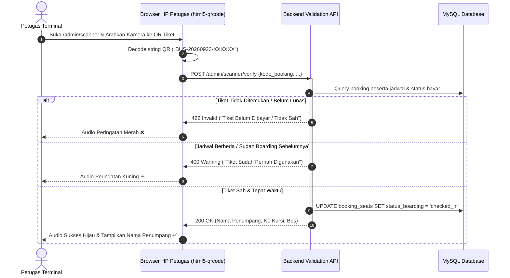
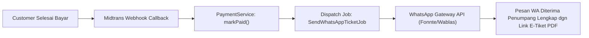

# 🔍 AUDIT FITUR EKSISTING & REKOMENDASI PENGEMBANGAN FITUR
## Analisis Mendalam Script Kode & Peta Jalan (Roadmap) Sistem Pemesanan Tiket Bus

Dokumen ini disusun berdasarkan hasil audit menyeluruh terhadap seluruh berkas skrip controller, service layer, model Eloquent, view Blade, serta riwayat commit pada repositori aplikasi **Pemesanan Tiket Bus**.

---

## 📑 DAFTAR ISI
1. [Inventaris & Analisis Fitur Eksisting](#1-inventaris--analisis-fitur-eksisting)
2. [Temuan Celah Teknis & Bug Script Saat Ini](#2-temuan-celah-teknis--bug-script-saat-ini)
3. [Matriks Matang Fitur (Feature Maturity Matrix)](#3-matriks-matang-fitur-feature-maturity-matrix)
4. [Rekomendasi Fitur Masa Depan (Prioritas & Spesifikasi)](#4-rekomendasi-fitur-masa-depan-prioritas--spesifikasi)
5. [Arsitektur Rencana Fitur Baru Unggulan](#5-arsitektur-rencana-fitur-baru-unggulan)

---

## 1. Inventaris & Analisis Fitur Eksisting

Berdasarkan penelusuran script pada `app/Http/Controllers/`, `app/Services/`, dan `resources/views/`, berikut adalah fitur-fitur yang telah terimplementasi:

### 1.1. Modul Publik & Pencarian Tiket
| Fitur | Berkas Script Pengendali | Deskripsi & Kemampuan Teknis |
|---|---|---|
| **Landing Page & Rute Populer** | [`HomeController.php`](file:///C:/laragon/www/rap/app/Http/Controllers/HomeController.php), [`pages/landing/index.blade.php`](file:///C:/laragon/www/rap/resources/views/pages/landing/index.blade.php) | Menampilkan daftar terminal aktif, PO bus terdaftar beserta jumlah armadanya, dan 6 rute terpopuler dengan jumlah jadwal terbanyak. |
| **Pencarian Multi-Filter** | [`TicketController.php`](file:///C:/laragon/www/rap/app/Http/Controllers/TicketController.php) (`search`) | Pencarian jadwal berdasarkan: Terminal Asal, Terminal Tujuan, Tanggal, dan Jumlah Penumpang (1-5 orang). Mendukung filter lanjutan: Kelas Bus, Operator PO, Rentang Harga Maksimal, dan Jam Berangkat Mulai. Menghitung sisa kursi real-time via `seatCount()`. |
| **Denah Kursi Interaktif** | [`TicketController.php`](file:///C:/laragon/www/rap/app/Http/Controllers/TicketController.php) (`seats`), [`pages/tiket/kursi.blade.php`](file:///C:/laragon/www/rap/resources/views/pages/tiket/kursi.blade.php) | Menampilkan denah bus 2-2 dinamis dengan indikator warna: Hijau (Tersedia), Merah (Terisi), Kuning (Sedang Dipilih). Membatasi pemilihan kursi maksimal sesuai jumlah penumpang. |

### 1.2. Modul Pemesanan & Alur Checkout
| Fitur | Berkas Script Pengendali | Deskripsi & Kemampuan Teknis |
|---|---|---|
| **Form Data Penumpang** | [`BookingController.php`](file:///C:/laragon/www/rap/app/Http/Controllers/BookingController.php) (`passengerForm`), [`pages/booking/form.blade.php`](file:///C:/laragon/www/rap/resources/views/pages/booking/form.blade.php) | Mengumpulkan data detail tiap penumpang: Nama Lengkap, NIK (validasi regex 16 digit), No. HP, Jenis Kelamin (L/P), dan Tanggal Lahir. |
| **Atomic Seat Locking** | [`BookingService.php`](file:///C:/laragon/www/rap/app/Services/BookingService.php) (`createBooking`) | Menggunakan transaksi database `DB::transaction()` dipadukan dengan *Pessimistic Row Lock* `lockForUpdate()` pada tabel `jadwals` dan `kursis`. Menghasilkan kode booking unik `BUS-YYYYMMDD-XXXXXX`. |
| **Batas Kedaluwarsa Otomatis** | [`BookingService.php`](file:///C:/laragon/www/rap/app/Services/BookingService.php) (`expiredAt`) | Menetapkan batas waktu bayar (2 jam dari booking atau saat bus berangkat, mana yang lebih awal). |

### 1.3. Modul Pembayaran & Integrasi Gateway
| Fitur | Berkas Script Pengendali | Deskripsi & Kemampuan Teknis |
|---|---|---|
| **Midtrans Snap Popup** | [`BookingController.php`](file:///C:/laragon/www/rap/app/Http/Controllers/BookingController.php) (`pay`), [`PaymentService.php`](file:///C:/laragon/www/rap/app/Services/PaymentService.php), [`pages/booking/payment.blade.php`](file:///C:/laragon/www/rap/resources/views/pages/booking/payment.blade.php) | Inisialisasi Snap Token dengan item rincian kursi dan customer details. Membuka modal pembayaran Midtrans (QRIS, VA, E-Wallet). |
| **Fallback Pembayaran Loket** | [`PaymentService.php`](file:///C:/laragon/www/rap/app/Services/PaymentService.php), [`AdminBookingController.php`](file:///C:/laragon/www/rap/app/Http/Controllers/AdminBookingController.php) | Jika Midtrans belum dikonfigurasi, sistem menyediakan instruksi pembayaran tunai loket dan admin dapat mengonfirmasi via `confirmManually()`. |
| **Webhook IPN Asynchronous** | [`BookingController.php`](file:///C:/laragon/www/rap/app/Http/Controllers/BookingController.php) (`callback`), [`PaymentService.php`](file:///C:/laragon/www/rap/app/Services/PaymentService.php) (`handleNotification`) | Endpoint bebas CSRF `/payment/callback` memvalidasi `gross_amount` notifikasi dengan harga pesanan, kemudian memperbarui status `paid` dan `confirmed` secara otomatis. |

### 1.4. Modul Tiket Elektronik & Verifikasi
| Fitur | Berkas Script Pengendali | Deskripsi & Kemampuan Teknis |
|---|---|---|
| **E-Tiket Digital** | [`BookingController.php`](file:///C:/laragon/www/rap/app/Http/Controllers/BookingController.php) (`ticket`), [`TicketService.php`](file:///C:/laragon/www/rap/app/Services/TicketService.php), [`pages/booking/ticket.blade.php`](file:///C:/laragon/www/rap/resources/views/pages/booking/ticket.blade.php) | Menyajikan rincian lengkap rute, bus, kelas, fasilitas, daftar kursi penumpang, status lunas (`PAID`), serta tata letak cetak ramah printer (`@media print`). |
| **Dynamic SVG QR Code** | [`TicketService.php`](file:///C:/laragon/www/rap/app/Services/TicketService.php) (`qrCode`) | Mengonversi kode booking ke dalam format string SVG Data URI (`data:image/svg+xml;base64,...`) menggunakan pustaka `simplesoftwareio/simple-qrcode`. |

### 1.5. Modul Portal Customer
| Fitur | Berkas Script Pengendali | Deskripsi & Kemampuan Teknis |
|---|---|---|
| **Customer Dashboard** | [`CustomerController.php`](file:///C:/laragon/www/rap/app/Http/Controllers/CustomerController.php) (`dashboard`) | Kartu ringkasan perjalanan, booking aktif, dan statistik tiket. |
| **Riwayat Pemesanan** | [`CustomerController.php`](file:///C:/laragon/www/rap/app/Http/Controllers/CustomerController.php) (`bookings`) | Riwayat booking terpaginasi dengan tab filter status (`pending`, `confirmed`, `completed`, `cancelled`, `expired`). |
| **Daftar Tiket Aktif** | [`CustomerController.php`](file:///C:/laragon/www/rap/app/Http/Controllers/CustomerController.php) (`tickets`) | Menampilkan seluruh e-tiket yang telah lunas dan siap digunakan. |
| **Manajemen Profil** | [`CustomerController.php`](file:///C:/laragon/www/rap/app/Http/Controllers/CustomerController.php) (`profile`, `profileUpdate`) | Mengubah nama, nomor telepon, dan password customer. |

### 1.6. Modul Administrasi Back-Office (Stisla Admin)
| Fitur | Berkas Script Pengendali | Deskripsi & Kemampuan Teknis |
|---|---|---|
| **Dashboard Metrik & Visualisasi** | [`DashboardController.php`](file:///C:/laragon/www/rap/app/Http/Controllers/DashboardController.php) | Metrik pendapatan hari ini & bulan ini, grafik tren omset 12 bulan (Chart.js), tren pemesanan bulanan, 5 rute terpopuler, 5 operator terlaris, serta audit log transaksi terbaru. |
| **CRUD Master PO Operator** | [`OperatorController.php`](file:///C:/laragon/www/rap/app/Http/Controllers/OperatorController.php) | Pengelolaan profil PO bus, kode operator, nomor telepon, dan status. |
| **CRUD Master Armada Bus** | [`BusController.php`](file:///C:/laragon/www/rap/app/Http/Controllers/BusController.php) | Pengelolaan bus, nomor polisi, kapasitas, fasilitas, serta **Auto Seat Generator** yang otomatis membuat kursi default saat bus didaftarkan. |
| **CRUD & Konfigurasi Kursi** | [`KursiController.php`](file:///C:/laragon/www/rap/app/Http/Controllers/KursiController.php) | Kustomisasi nomor kursi, kelas kursi, harga khusus kursi, posisi (jendela/lorong), dan kondisi fisik kursi (tersedia/rusak). |
| **CRUD Terminal & Geolokasi** | [`TerminalController.php`](file:///C:/laragon/www/rap/app/Http/Controllers/TerminalController.php) | Pengelolaan terminal bus lengkap dengan koordinat Latitude dan Longitude. |
| **CRUD Rute Perjalanan** | [`RuteController.php`](file:///C:/laragon/www/rap/app/Http/Controllers/RuteController.php) | Menghubungkan terminal asal dan tujuan beserta jarak (KM) dan durasi (menit). |
| **CRUD Jadwal Keberangkatan** | [`JadwalController.php`](file:///C:/laragon/www/rap/app/Http/Controllers/JadwalController.php) | Penjadwalan bus pada rute tertentu, tanggal, jam berangkat, jam tiba, tarif dasar, dan status keberangkatan. |
| **Monitoring & Aksi Pemesanan** | [`AdminBookingController.php`](file:///C:/laragon/www/rap/app/Http/Controllers/AdminBookingController.php) | Melihat detail pesanan, konfirmasi pembayaran manual, ubah status pesanan, dan batalkan pesanan. |
| **Audit Pembayaran Gateway** | [`PaymentController.php`](file:///C:/laragon/www/rap/app/Http/Controllers/PaymentController.php) | Log seluruh riwayat transaksi Midtrans (Order ID, Transaction ID, Payment Type, Gross Amount). |
| **Laporan & Cetak Rekapitulasi** | [`ReportController.php`](file:///C:/laragon/www/rap/app/Http/Controllers/ReportController.php) | Filter laporan berdasarkan rentang tanggal, operator, bus, rute terminal, dan status bayar. Dilengkapi tampilan cetak formal (`?cetak=true`). |

---

## 2. Temuan Celah Teknis & Bug Script Saat Ini

Berdasarkan audit mendalam terhadap kode sumber, ditemukan beberapa hal penting yang harus diperhatikan:

### ⚠️ Temuan 1: Method `calculateDistance` Terhapus pada `RuteController.php`
- **Lokasi Masalah**: [`routes/web.php`](file:///C:/laragon/www/rap/routes/web.php#L124) mendefinisikan rute `admin.rute.calculate-distance` yang mengarah ke `RuteController@calculateDistance`.
- **Kondisi**: Pada commit `2fe5de9`, method `calculateDistance` secara tidak sengaja terhapus dari [`RuteController.php`](file:///C:/laragon/www/rap/app/Http/Controllers/RuteController.php).
- **Dampak**: Fitur hitung jarak otomatis via API OSRM (`router.project-osrm.org`) pada form tambah rute saat ini akan error 500 (*Method does not exist*).
- **Solusi**: Mengembalikan (*restore*) method tersebut ke `RuteController.php`.

### ⚠️ Temuan 2: Kolom `kelas` Terkomentari pada Migrasi `buses`
- **Lokasi Masalah**: [`database/migrations/2026_07_18_232021_create_buses_table.php`](file:///C:/laragon/www/rap/database/migrations/2026_07_18_232021_create_buses_table.php#L19).
- **Kondisi**: Baris kolom `kelas` terkomentari, padahal `BusController`, `BusFactory`, dan `TicketService` mewajibkannya.
- **Dampak**: Test suite `BookingFlowTest` gagal dengan galat SQL 1054 (`Unknown column 'kelas' in 'field list'`).

### ⚠️ Temuan 3: Format Parameter URL Pemilihan Kursi
- **Lokasi Masalah**: Pada [`pages/tiket/kursi.blade.php`](file:///C:/laragon/www/rap/resources/views/pages/tiket/kursi.blade.php#L194):
  ```javascript
  const url = '{{ route("booking.form", $jadwal->id_jadwal) }}' + '?seats=' + selected.join(',');
  ```
- **Kondisi**: JavaScript mengirimkan `?seats=1,2`, sementara di [`BookingController@passengerForm`](file:///C:/laragon/www/rap/app/Http/Controllers/BookingController.php#L37):
  ```php
  $seatIds = array_values(array_filter((array) $request->query('seats', []), fn($v) => is_numeric($v)));
  ```
  Nilai `(array) "1,2"` menghasilkan `["1,2"]`, di mana `is_numeric("1,2")` bernilai `false`.
- **Dampak**: Jika menggunakan koma tanpa parsing `explode(',', ...)`, pengguna berpotensi ditolak dan dialihkan kembali dengan pesan "Pilih minimal satu kursi".

### ⚠️ Temuan 4: Ketiadaan Cron Worker untuk Membatalkan Booking Kedaluwarsa
- **Kondisi**: Booking yang tidak dibayar dalam 2 jam hanya diubah statusnya menjadi `expired` jika customer secara kebetulan membuka URL `/booking/{id}/bayar`.
- **Dampak**: Jika customer menutup browser dan tidak pernah kembali, kursi tersebut akan tetap terkunci dengan status `pending` dan tidak dapat dibeli oleh orang lain.

---

## 3. Matriks Matang Fitur (Feature Maturity Matrix)

```
[Legend]
✅ Lengkap & Berfungsi Baik
⚠️ Berfungsi namun Memiliki Celah / Perlu Perbaikan
❌ Belum Tersedia / Perlu Didevelop
```

| Modul & Fungsionalitas | Status Saat Ini | Keterangan & Catatan Teknis |
|---|:---:|---|
| Pencarian Jadwal & Rute | ✅ | Multi-filter lengkap (harga, kelas, jam, PO) |
| Denah Kursi Interaktif | ⚠️ | Berfungsi baik, perlu perbaikan passing parameter URL |
| Concurrency Seat Locking | ✅ | Menggunakan `lockForUpdate()` & `DB::transaction()` |
| Integrasi Pembayaran Midtrans Snap | ✅ | Popup Snap JS & Webhook IPN handler berfungsi |
| E-Tiket Digital & SVG QR Code | ✅ | SVG data URI dynamic rendering |
| Dashboard & Laporan Admin | ✅ | Visualisasi grafik Chart.js & cetak laporan formal |
| Hitung Jarak & Durasi Rute Otomatis | ⚠️ | Rute terdaftar di `web.php`, method di controller hilang |
| Auto-Cancel Expired Bookings (Cron) | ❌ | Belum ada background artisan command / scheduler |
| Unduh PDF Tiket Resmi (DomPDF) | ❌ | Saat ini baru mendukung browser print HTML (`window.print`) |
| Notifikasi WhatsApp / SMS | ❌ | Nomor HP tercatat di database namun belum ada gateway |
| Scanner Tiket Petugas Boarding | ❌ | QR Code ada, namun belum ada portal pemindai kamera petugas |
| Reschedule & Pembatalan Mandiri | ❌ | Pembatalan baru bisa dilakukan via admin |
| Titik Jemput & Turun (Pickup/Dropoff) | ❌ | Masih mengacu pada satu terminal asal dan tujuan |
| Manifest Penumpang untuk Supir | ❌ | Belum ada fitur cetak daftar penumpang bus per jadwal |
| Multi-Tenancy Portal PO Bus | ❌ | Seluruh PO dikelola bersama oleh Super Admin |
| REST API Mobile Ready (Sanctum) | ❌ | Endpoint API mobile belum dibangun |

---

## 4. Rekomendasi Fitur Masa Depan (Prioritas & Spesifikasi)

Berikut rancangan fitur rekomendasi yang disusun berdasarkan skala prioritas:

### 🟢 TIER 1: Perbaikan Stabilitas & Fondasi (Immediate / Sprint 1)
1. **Perbaikan Skema & Restore Script Eksisting**:
   - Membuka komentar kolom `kelas` pada migrasi `buses`.
   - Mengembalikan method `calculateDistance` pada [`RuteController.php`](file:///C:/laragon/www/rap/app/Http/Controllers/RuteController.php).
   - Memperbaiki parsing query parameter kursi pada [`BookingController.php`](file:///C:/laragon/www/rap/app/Http/Controllers/BookingController.php) (`explode(',', $seats)`).
2. **Scheduled Worker: Auto-Cancel Expired Booking**:
   - Perintah Artisan: `php artisan booking:cancel-expired`.
   - Menelusuri seluruh record `bookings` dengan status `pending` dan `expired_at < now()`.
   - Mengubah status booking & seats menjadi `expired` secara atomik, sehingga kursi otomatis terbuka kembali bagi publik.

### 🟡 TIER 2: Pengalaman Pengguna & Kepuasan Penumpang (Short-Term / Sprint 2)
1. **Export PDF E-Tiket Resmi Berstandar Cetak**:
   - Pustaka: `barryvdh/laravel-dompdf`.
   - Tombol "Download PDF" pada halaman tiket.
   - Dokumen PDF memuat: Logo PO Bus, Barcode Code128, QR Code, Instruksi Boarding, Kebijakan Bagasi, dan Syarat Perjalanan.
2. **Notifikasi WhatsApp Otomatis (WhatsApp Gateway)**:
   - Integrasi API gateway (Fonnte / Wablas / Twilio).
   - Event Trigger:
     - Saat booking dibuat: Mengirim nomor rekening / link pembayaran Midtrans.
     - Saat pembayaran sukses: Mengirim link download e-tiket PDF.
     - H-4 jam keberangkatan: Pengingat jadwal dan nomor armada bus.
3. **Pilihan Titik Naik (Pick-up Point) & Titik Turun (Drop-off Point)**:
   - Menambahkan tabel `rute_stops` (Pool, SPBU, Agen Resmi di sepanjang jalur rute).
   - Penumpang dapat memilih di agen mana mereka akan naik bus tanpa harus datang ke terminal induk.
4. **Portal Reschedule & Pembatalan Tiket Mandiri**:
   - Customer dapat mengajukan reschedule tanggal/jadwal tiket sebelum H-24 jam.
   - Kebijakan biaya administrasi (misal: potongan 25% untuk refund).

### 🟠 TIER 3: Operasional Lapangan & Efisiensi Terminal (Mid-Term / Sprint 3)
1. **Portal Web Scanner Petugas Terminal (Boarding Gate)**:
   - Halaman khusus: `/admin/scanner` (dapat diakses lewat smartphone petugas).
   - Menggunakan library JavaScript `html5-qrcode` untuk mengakses kamera HP petugas.
   - Saat QR Code tiket di-scan:
     - Sistem langsung memverifikasi ke database: Apakah tiket valid? Apakah jadwal sesuai hari ini? Apakah sudah pernah check-in sebelumnya?
     - Mengubah status penumpang menjadi `checked_in` dan membunyikan nada audio verifikasi (Beep hijau / Buzzer merah).
2. **Cetak Manifest Penumpang untuk Supir & Kru Bus**:
   - Format cetak lembar manifest perjalanan per jadwal bus.
   - Berisi nomor kursi, nama penumpang, kontak, tujuan turun, dan kolom tanda tangan kondektur.
3. **Manajemen Kru Bus (Driver & Crew Allocation)**:
   - Tabel `supirs` dan penugasan Kru Utama + Cadangan pada tiap jadwal perjalanan.

### 🔵 TIER 4: Kemitraan Bisnis, Ekosistem, & Mobile API (Long-Term / Sprint 4)
1. **Multi-Tenancy Portal PO Bus (Operator Dashboard)**:
   - Akun role baru: `operator`.
   - Pengelola PO Bus (misal PO Lorena, PO Sinar Jaya) hanya dapat melihat, menambah armada bus, mengatur jadwal, dan melihat omset milik PO mereka sendiri.
2. **Sistem Kode Promo & Voucher Diskon**:
   - Tabel `vouchers` (kode voucher, kuota pemakaian, nominal diskon / persentase, tanggal berlaku).
   - Pengurangan total harga secara otomatis pada halaman formulir booking.
3. **RESTful API Mobile (Sanctum Integration)**:
   - Menyediakan API terstandarisasi untuk mendukung pengembangan aplikasi Android / iOS menggunakan Flutter atau React Native.

---

## 5. Arsitektur Rencana Fitur Baru Unggulan

### 5.1. Alur Verifikasi Tiket di Pintu Masuk (Scanner Boarding)



### 5.2. Alur Pengiriman Notifikasi WhatsApp Otomatis


