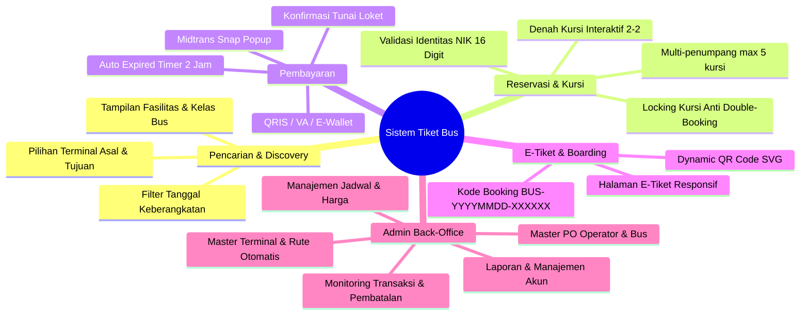

# 📄 PRODUCT REQUIREMENTS DOCUMENT (PRD)
## Sistem Informasi & Pemesanan Tiket Bus Online

---

## 1. Ikhtisar Produk (Product Overview)
Sistem **Pemesanan Tiket Bus Online** adalah platform web terintegrasi yang mendigitalisasi seluruh rantai nilai reservasi tiket bus antarkota (AKAP) dan pariwisata. Platform ini menghubungkan calon penumpang dengan operator bus melalui antarmuka pencarian jadwal yang intuitif, pemilihan kursi interaktif langsung dari denah bus, pemrosesan transaksi real-time dengan payment gateway terakreditasi (Midtrans), serta penerbitan tiket elektronik ber-QR Code untuk kemudahan verifikasi keberangkatan.

### 1.1. Pernyataan Masalah (Problem Statement)
- **Calon Penumpang**: Sering menghadapi antrean panjang di loket terminal fisik, ketidakpastian ketersediaan kursi, kurangnya transparansi fasilitas dan harga armada bus, serta risiko kehilangan tiket fisik kertas.
- **Operator Bus / PO**: Mengalami kesulitan rekonsiliasi pembayaran tunai, risiko terjadinya *double booking* kursi akibat pencatatan manual, dan lambatnya pelaporan tingkat keterisian armada (load factor).
- **Manajemen Terminal / Loket**: Memerlukan sistem validasi boarding yang cepat tanpa memicu kemacetan di pintu masuk bus.

### 1.2. Tujuan Produk (Product Goals)
1. **Zero Double-Booking**: Menjamin integritas pemesanan kursi bus dengan isolasi transaksi database berkecepatan tinggi.
2. **Seamless Payment**: Menyediakan metode pembayaran multi-kanal (QRIS, Virtual Account bank besar, E-Wallet) dengan konfirmasi instan.
3. **Paperless Experience**: Menerbitkan e-tiket digital mandiri yang dapat langsung di-scan saat boarding di terminal.
4. **Comprehensive Back-Office**: Memberikan kemudahan bagi pengelola untuk mengatur armada, menghitung jarak rute secara presisi, serta memonitor jadwal dan omset.

---

## 2. Persona Pengguna (User Personas)

| Persona | Profil & Tanggung Jawab | Kebutuhan Utama |
|---|---|---|
| **Rian (Penumpang Komuter / Wisatawan)** | Penumpang umum yang membutuhkan perjalanan antar kota yang terjadwal dan nyaman. | - Pencarian cepat berdasarkan kota asal & tujuan.<br>- Melihat fasilitas bus (AC, Wifi, Toilet, Reclining Seat).<br>- Memilih posisi kursi favorit (jendela/lorong).<br>- Pembayaran online instan via QRIS/VA.<br>- Akses tiket instan di HP. |
| **Budi (Petugas Loket Terminal)** | Staf operasional loket di terminal bus. | - Melayani pembelian tiket bagi penumpang walk-in.<br>- Konfirmasi pembayaran tunai (cash).<br>- Akses cepat terhadap sisa kursi tiap bus. |
| **Siti (Admin Operasional PO Bus)** | Manajer armada dan penjadwalan bus. | - Menginput dan mengelola data bus & kapasitas kursi.<br>- Membuat jadwal perjalanan dan mengatur tarif.<br>- Mengotomasi perhitungan jarak antar terminal.<br>- Mencetak manifest penumpang untuk kru bus. |
| **Dewi (Admin Keuangan / Super Admin)** | Pengawas finansial dan performa bisnis. | - Rekonsiliasi transaksi pembayaran Midtrans dan tunai.<br>- Melihat ringkasan omset dan grafik penjualan.<br>- Manajemen akun staf admin. |

---

## 3. Ruang Lingkup Fitur (Feature Scope)



---

## 4. Kebutuhan Fungsional & User Stories

### 4.1. Modul Pencarian & Discovery
- **FR-01**: Pengguna publik dapat mencari jadwal perjalanan aktif dengan memilih terminal asal, terminal tujuan, dan tanggal perjalanan.
- **FR-02**: Sistem menampilkan daftar jadwal yang sesuai, mencakup nama operator, kelas bus (Ekonomi, Bisnis, Eksekutif, Sleeper), jam keberangkatan/kedatangan, estimasi durasi, harga tiket, dan sisa kursi.
- **User Story**:
  > *Sebagai calon penumpang, saya ingin mencari rute dari Terminal A ke Terminal B pada tanggal tertentu agar saya dapat memilih jadwal bus yang paling sesuai dengan agenda saya.*

### 4.2. Modul Pemilihan Kursi & Input Penumpang
- **FR-03**: Sistem menampilkan denah kursi bus secara dinamis sesuai kapasitas dan konfigurasi baris/kolom armada.
- **FR-04**: Kursi yang sudah terpesan (berstatus `pending`, `confirmed`, atau `completed`) wajib ditampilkan dengan warna abu-abu/terkunci dan tidak dapat dipilih.
- **FR-05**: Pengguna dapat memilih 1 hingga maksimal 5 kursi dalam satu pesanan.
- **FR-06**: Pengguna wajib mengisikan identitas lengkap per kursi: Nama Lengkap, NIK (wajib tepat 16 digit numerik), No. HP, Jenis Kelamin (L/P), dan Tanggal Lahir.
- **User Story**:
  > *Sebagai penumpang, saya ingin memilih nomor kursi spesifik (misal 1A di jendela) dan memasukkan data penumpang agar kursi tersebut terjamin khusus untuk saya.*

### 4.3. Modul Reservasi & Concurrency Protection
- **FR-07**: Saat pesanan disubmit, sistem wajib menerapkan *pessimistic row locking* pada database transaksi untuk memvalidasi bahwa seluruh kursi yang dipilih masih benar-benar kosong.
- **FR-08**: Jika ada kursi yang diserobot oleh pengguna lain dalam fraksi detik yang sama, transaksi dibatalkan (rollback) dan pengguna diarahkan kembali dengan notifikasi error yang jelas.
- **FR-09**: Jika valid, sistem menerbitkan `kode_booking` unik dengan format `BUS-YYYYMMDD-XXXXXX` dan menetapkan waktu kedaluwarsa pembayaran (maksimal 2 jam dari pemesanan atau saat jam keberangkatan bus, mana yang lebih awal).
- **User Story**:
  > *Sebagai sistem, saya harus memastikan tidak ada dua transaksi yang berhasil memesan nomor kursi yang sama pada satu jadwal bus.*

### 4.4. Modul Pembayaran (Gateway & Loket)
- **FR-10**: Integrasi Midtrans Snap untuk memunculkan modal checkout pembayaran tanpa meninggalkan website.
- **FR-11**: Mendukung notifikasi asynchronous (Webhook IPN) dari Midtrans ke `/payment/callback` untuk mengubah status pesanan secara otomatis menjadi `paid` dan `confirmed`.
- **FR-12**: Verifikasi integritas pembayaran: Sistem mencocokkan `gross_amount` dari notifikasi dengan `total_harga` di database sebelum mengonfirmasi pembayaran.
- **FR-13**: Admin memiliki hak untuk melakukan konfirmasi manual (*cash payment*) bagi penumpang yang membayar tunai di loket terminal.
- **User Story**:
  > *Sebagai pembeli, saya ingin membayar via QRIS langsung dari HP saya dan segera memperoleh konfirmasi otomatis tanpa perlu upload bukti transfer manual.*

### 4.5. Modul Tiket Elektronik & Verifikasi
- **FR-14**: Tiket digital hanya dapat diakses apabila status pembayaran bernilai `paid`.
- **FR-15**: E-tiket memuat: Nama Operator, Nomor Polisi & Nama Bus, Kelas Bus, Terminal Asal & Tujuan, Waktu Berangkat & Tiba, Daftar Penumpang & Nomor Kursi, serta QR Code SVG dinamis.
- **FR-16**: QR Code mengenkapsulasi string `kode_booking` untuk discan oleh petugas boarding.

### 4.6. Modul Administrasi & Operasional
- **FR-17**: CRUD Operator Bus (Nama PO, Kode Operator, Kontak, Status).
- **FR-18**: CRUD Armada Bus (Nomor Polisi, Kode Bus, Kelas, Kapasitas, Fasilitas, Status). Saat bus dibuat, denah kursi dasar di-generate otomatis.
- **FR-19**: CRUD Terminal (Koordinat Latitude/Longitude, Alamat, Kota, Provinsi).
- **FR-20**: CRUD Rute dengan fitur **Hitung Jarak & Durasi Otomatis** berdasarkan koordinat terminal asal dan tujuan.
- **FR-21**: CRUD Jadwal Keberangkatan Bus (Penentuan bus, rute, tanggal, jam, dan harga dasar).
- **FR-22**: Manajemen Transaksi Booking (Monitoring status, batalkan pesanan, konfirmasi cash).

---

## 5. Kebutuhan Non-Fungsional (Non-Functional Requirements)

| Aspek | Spesifikasi Kebutuhan |
|---|---|
| **Performa** | - Waktu respons halaman katalog dan pencarian jadwal < 1.5 detik.<br>- Proses locking dan pembuatan booking < 1 detik pada beban normal.<br>- Waktu respons endpoint webhook Midtrans < 500 ms. |
| **Keamanan** | - Password di-hash menggunakan algoritma Bcrypt kuat.<br>- Seluruh form dilindungi CSRF token Laravel (kecuali endpoint webhook pembayaran Midtrans yang divalidasi via Order ID dan signature).<br>- Otorisasi berbasis hak akses (Role-based access: Admin vs Customer) dan perlindungan kepemilikan data (Customer A tidak boleh membuka data booking Customer B). |
| **Ketersediaan** | - Sistem uptime target: 99.5%.<br>- Graceful degradation: Jika konfigurasi gateway Midtrans offline, pesanan tetap dapat dibuat dalam status pending untuk konfirmasi loket. |
| **Integritas Data** | - ACID Compliance penuh pada transaksi pemesanan kursi melalui database engine InnoDB (MySQL). |
| **Kompatibilitas** | - Tampilan responsif pada perangkat desktop, tablet, dan smartphone (dukungan Bootstrap Stisla). |

---

## 6. Kriteria Penerimaan (Acceptance Criteria Sample)

```gherkin
Scenario: Reservasi Kursi Berhasil
  Given Customer telah login dan berada pada halaman denah kursi untuk Jadwal #10
  When Customer memilih kursi "2A" dan "2B" yang masih berwarna hijau (tersedia)
  And Mengisi data 2 penumpang dengan NIK valid 16 digit
  And Menekan tombol "Lanjutkan Pemesanan"
  Then Sistem berhasil membuat record di tabel bookings dan booking_seats
  And Sistem mengalokasikan kode booking "BUS-20260923-XXXXXX"
  And Customer diarahkan ke halaman pembayaran dengan status "unpaid"

Scenario: Penolakan Kursi yang Bersamaan Dipesan (Race Condition)
  Given Customer A dan Customer B sama-sama memilih kursi "1A" pada jadwal yang sama
  When Customer A menekan tombol bayar 1 milidetik lebih awal dari Customer B
  Then Transaksi Customer A berhasil ter-commit
  And Transaksi Customer B otomatis di-rollback
  And Customer B menerima pesan error "Kursi 1A sudah dipesan orang lain. Silakan pilih kursi lain."
```

---

## 7. Metrik Keberhasilan Produk (Product Success KPIs)
1. **Tingkat Kegagalan Booking (Error Rate)**: < 0.1% dari total percobaan checkout.
2. **Insiden Double-Booking**: 0 insiden (Zero tolerance).
3. **Conversion Rate Pencarian ke Pembayaran**: > 25%.
4. **Waktu Rata-rata Checkout**: < 3 menit dari pemilihan jadwal hingga pembayaran selesai.
